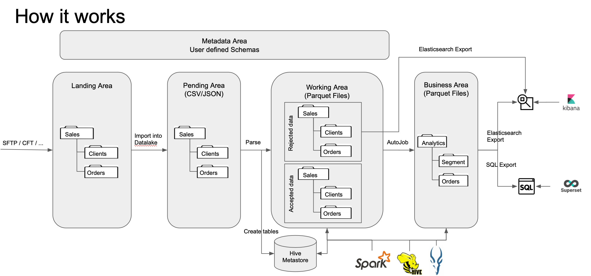

# About Comet Data Pipeline

Complete documentation available [here](https://comet-app.readthedocs.io/)

## Introduction

The purpose of this project is to efficiently ingest various data
sources in different formats and make them available for analytics.
Usualluy, ingestion is done by writing hand made custom parsers that
transform input files into datasets of records.

This project aims at automating this parsing task by making data
ingestion purely declarative.

The workflow below is a typical use case :

* Export your data as a set of DSV (Delimiter-separated values) or JSON files
* Define each DSV/JSON file with a schema using YAML syntax
* Configure the ingestion process
* Start watching your data being available as Hive Tables in your  datalake

The main advantages of the Comet Data Pipeline project are :

* Eliminates manual coding for data ingestion
* Assign metadata to each dataset
* Expose data ingestion metrics and history
* Transform text files to strongly typed records
* Support semantic types
* Force privacy on specific fields (RGPD)
* very, very simple piece of software to administer

## How it works

Comet Data Pipeline automates the loading and parsing of files and
their ingestion into a Hadoop Datalake where datasets become
available as Hive tables.

1. Landing Area : Files are first stored in the local file system
2. Staging Area : Files associated with a schema are imported into the datalake
3. Working Area : Staged Files are parsed against their schema and records are rejected or accepted and made available in parquet/orc/... files as Hive Tables.
4. Business Area : Tables in the working area may be joined to provide a hoslictic view of the data through the definition of AutoJob.
5. Data visualization : parquet/orc/... tables may be exposed in datawarehouses or elasticsearch indexes

