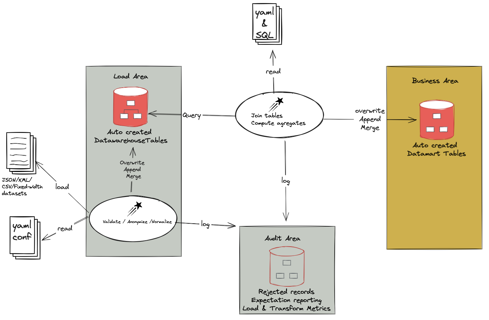
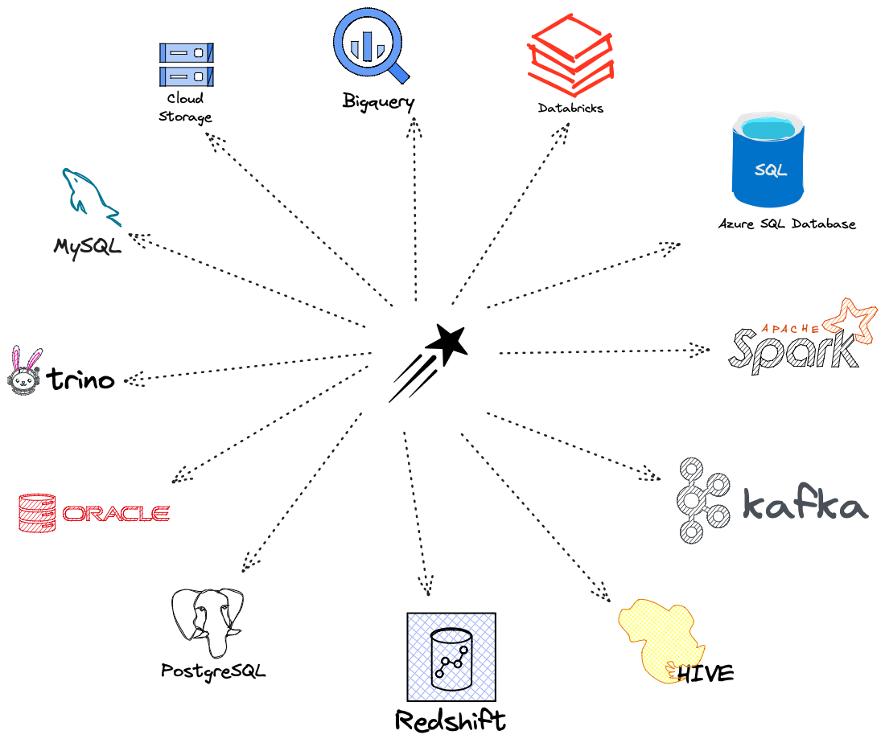

[](https://scala-steward.org)
[](https://codecov.io/gh/starlake-ai/starlake)
[](https://www.codacy.com/gh/starlake-ai/starlake/dashboard?utm_source=github.com&amp;utm_medium=referral&amp;utm_content=starlake-ai/starlake&amp;utm_campaign=Badge_Grade)
[](https://starlake-ai.github.io/starlake/)
[](https://maven-badges.herokuapp.com/maven-central/ai.starlake/starlake-spark3_2.12)
[](https://starlakeai.slack.com)
[](https://opensource.org/licenses/Apache-2.0)
# About Starlake

Complete documentation available [here](https://starlake-ai.github.io/starlake/index.html)
# What is Starlake ?

Starlake is a configuration only Extract, Load and Transform engine.
The workflow below is a typical use case:
* Extract your data as a set of Fixed Position, DSV (Delimiter-separated values) or JSON or XML files
* Define or infer the structure of each POSITION/DSV/JSON/XML file with a schema using YAML syntax
* Configure the loading process
* Start watching your data being available as Tables in your warehouse.
* Build aggregates using SQL, Jinja and YAML configuration files.

You may use Starlake for Extract, Load and Transform steps or any combination of these steps.

## How is Starlake different ?


Looking at ELT tools, we can see that they are either:
- __Code based__: They require to write code to define the data pipelines. This is the case for example for Databricks or Meltano.
- __GUI based__: They require to use a GUI to define the data pipelines. This is the case for example for Apache NiFi, Airbyte or Fivetran.

Looking at existing data orchestration tools, we can see that they are either:
- __Code based__: They require to write code to define the data pipelines. This is the case for example for Apache Airflow or Dagster.
- __GUI based__: They require to use a GUI to define the data pipelines. This is the case for example for Apache NiFi or StreamSets.


Starlake is different because it is declarative, meaning that we define our data pipelines using a YAML DSL (Domain Specific Language)
instead of writing code or using a GUI.

These YAMl files are then interpreted by Starlake runtime to execute your end to end data pipelines.

Among the properties you may specify in the YAML file, the following are worth mentioning:
* field normalization
* field encryption
* field renaming
* field removal
* field transformation
* field addition (computed fields)
* metrics computation
* semantic types by allowing you to set type constraints on the incoming data
* multiple file formats and source / target databases (Postgres, MySQL, SQL Server, Oracle, Snowflake, Redshift, BigQuery, ...)
* merge strategy (INSERT OVERWRITE or MERGE INTO)
* partitioning and clustering strategies
* data retention policies
* data quality rules
* data ownership
* data access policies
* schema evolution


The YAML DSL added value is best explained with an example:

### Extract

Let's say we want to extract data from a Postgres Server database on a daily basis
```yaml
extract:
  connectionRef: "pg-adventure-works-db" # or mssql-adventure-works-db i extracting from SQL Server
  jdbcSchemas:
    - schema: "sales"
      schedule: "0 0 * * *"                     # (optional) cron expression to schedule the extraction
      tables:
        - name: "salesorderdetail"              # table name or simple "*" to extract all tables
          partitionColumn: "salesorderdetailid" # (optional)  you may parallelize the extraction based on this field
          fetchSize: 100                        # (optional)  the number of rows to fetch at a time
          timestamp: salesdatetime              # (optional) the timestamp field to use for incremental extraction
      tableTypes:
        - "TABLE"
        #- "VIEW"
        #- "SYSTEM TABLE"
        #- "GLOBAL TEMPORARY"
        #- "LOCAL TEMPORARY"
        #- "ALIAS"
        #- "SYNONYM"
```

That's it, we have defined our extraction pipeline.

The YAML DSL is self-explanatory and easy to understand. It is also very concise and easy to maintain.

Starlake will take care of generating the corresponding DAG (Directed Acyclic Graph) and will run it on a daily basis on your favorite orchestrator (Airflow, Dagster, Prefect, ...).


### Load

Let's say we want to load the data extracted from the previous example into datawarehouse

```yaml
---
table:
  pattern: "salesorderdetail.*.psv" # This property is a regular expression that will be used to match the file name.
  schedule: "when_available"        # (optional) cron expression to schedule the loading
  metadata:
    mode: "FILE"
    format: "CSV"       # (optional) auto-detected if not specified
    encoding: "UTF-8"
    withHeader: yes     # (optional) auto-detected if not specified
    separator: "|"      # (optional) auto-detected if not specified
    write: "MERGE"
                        # Please replace it by the adequate file pattern eq. customers-.*.psv if required
  attributes:           # Description of the fields to recognize
    - name: "id"        # attribute name and column name in the destination table if no rename attribute is defined
      type: "string"    # expected type
      required: false   # Is this field required in the source (false by default, change it accordingly) ?
      privacy: "NONE"   # Should we encrypt this field before loading to the warehouse (No encryption by default )?
      ignore: false     # Should this field be excluded (false by default) ?
    - name: "signup"    # second attribute
      type: "timestamp" # auto-detected if  specified
    - name: "contact"
      type: "string"
      ...
  merge:  # (optional) when specified, the merge will be based on this field and only records that have changed will be updated
    timestamp: signup
    key: [id]
```

That's it, we have defined our loading pipeline.

The YAML DSL is self-explanatory and easy to understand. It is also very concise and easy to maintain.

Starlake will take care of generating the corresponding DAG (Directed Acyclic Graph) and will run it upon file
arrival on your orchestrator to validate the input against the YAML schema, apply schema updates
when needed/requested and finally producing a detailed reporting accessible via your favorite BI tool.

Starlake support almost any text base file format including FIXED_WIDTH_FIELDS, CSV, TSV, PSV, JSON, XML, AVRO, PARQUET, ORC ...


### Transform

Let's say we want to transform the data extracted from the previous example before loading it into a datawarehouse

```yaml

transform:
  default:
    write: OVERWRITE
  tasks:
    - name: most_profitable_products
      write: MERGE
      merge:
        timestamp: signup
        key: [id]
      sql: |              # based on the merge strategy and the current state,
          SELECT          # the SQL query will be translated into the appropriate MERGE INTO or INSERT OVERWRITE statement
            productid,
            SUM(unitprice * orderqty) AS total_revenue
            FROM salesorderdetail
            GROUP BY productid
            ORDER BY total_revenue DESC
```

That's it, we have defined our transformation pipeline. Starlake will take care of generating the corresponding DAG (Directed Acyclic Graph) and will run it
whenever  the tables referenced in the SQL query are updated.

Starlake will take care of applying the right merge strategy (INSERT OVERWRITE or MERGE INTO) based on `merge` property and the input /output tables .

### Orchestration

Starlake comes with a set of DAG templates that can be used to orchestrate your data pipelines on your favorite orchestrator (Airflow, Dagster, Prefect, ...).
Simply reference them in your YAML files  and optionally customize them to your needs.


The following dependencies are extracted from your SQL query and used to generate the corresponding DAG:


The resulting DAG is shown below:


## How it works

Starlake Data Pipeline automates the loading and parsing of files and
their ingestion into a warehouse where datasets become
available as strongly typed records.




The figure above describes how Starlake implements the `Extract Load Transform (ELT)` Data Pipeline steps.
Starlake may be used indistinctly for all or any of these steps.

* The `extract` step allows to export selective data from an existing SQL database to a set of CSV files.
* The `load` step allows you to load text files, to ingest POSITION/CSV/JSON/XML files as strong typed records stored as parquet files or DWH tables (eq. Google BigQuery) or whatever sink you configured
* The `transform` step allows to join loaded data and save them as parquet files, DWH tables or Elasticsearch indices

The Load Transform steps support multiple configurations for inputs and outputs as illustrated in the
figure below.




Starlake Data Pipeline steps are described below:

- Landing Area: In this optional step, files with predefined filename patterns are stored on a local filesystem in a predefined folder hierarchy
- Pending Area: Files associated with a schema are imported into this area.
- Accepted Area: Pending files are parsed against their schema and records are rejected or accepted and made available in  Bigquery/Snowflake/Databricks/Hive/... tables or parquet files in a cloud bucket.
- Business Area: Tables (Hive / BigQuery / Parquet files / ...) in the working area may be joined to provide a holistic view of the data through the definition of transformations.
- Data visualization: parquet files / tables may be exposed in data warehouses or elasticsearch indices through an indexing definition

Input file schemas, ingestion rules, transformation and indexing definitions used in the steps above are all defined in YAML files.


