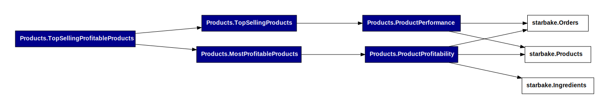
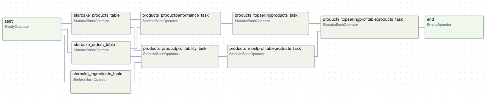

[](https://maven-badges.herokuapp.com/maven-central/ai.starlake/starlake-core_2.12)
[](https://opensource.org/licenses/Apache-2.0)


Starlake is a declarative text based tool that enables analysts and engineers to extract, load, transform and orchestrate their data pipelines.

<p align="center">
  
</p>


Starlake is a configuration only Extract, Load, Transform and Orchestration Declarative Data Pipeline Tool.
The workflow below is a typical use case:
* **Extract** your data as a set of Fixed Position, DSV (Delimiter-separated values) or JSON or XML files
* Define or infer table schemas fom text files (csv, json, xml, fixed-width ...)
* **Load**: Define transformations at load time using YAML and start **loading** files into your datawarehouse.
* **Transform**: Build aggregates using regular SQL SELECT statements and let Starlake build your tables with respect to your selected strategy (Append, Overwrite, Merge ...).
* **Orchestrate**: Let Starlake handle your data lineage and run your data pipelines on your favorite orchestrator (Airflow, Dagster ... ).

You may use Starlake for Extract, Load and Transform steps or any combination of these steps.

# How it works

The advent of declarative programming, exemplified by tools like Ansible and Terraform,
has revolutionized infrastructure deployment by allowing developers to express intended goals without specifying the order of code execution.
This paradigm shift brings forth benefits such as reduced error prone coding tasks, significantly shortened development cycles,
enhanced code readability, and increased accessibility for developers of all levels.

Starlake is a YAML-based declarative tool designed for expressing Extract, Load, Transform, and Orchestration tasks.
Drawing inspiration from the successes of declarative programming in infrastructure,
Starlake aims to bring similar advantages to the realm of data engineering.

This paradigm shift  encourages a focus on defining goals for data warehouses,
rather than the intricacies of implementation details.


The YAML DSL is self-explanatory and easy to understand. This is best explained with an example:

## Extract

Let's say we want to extract data from a Postgres Server database on a daily basis
```yaml
extract:
  connectionRef: "pg-adventure-works-db" # or mssql-adventure-works-db i extracting from SQL Server
  jdbcSchemas:
    - schema: "sales"
      tables:
        - name: "salesorderdetail"              # table name or simple "*" to extract all tables
          partitionColumn: "salesorderdetailid" # (optional)  you may parallelize the extraction based on this field
          fetchSize: 100                        # (optional)  the number of rows to fetch at a time
          timestamp: salesdatetime              # (optional) the timestamp field to use for incremental extraction
      tableTypes:
        - "TABLE"
        #- "VIEW"
        #- "SYSTEM TABLE"
        #- "GLOBAL TEMPORARY"
        #- "LOCAL TEMPORARY"
        #- "ALIAS"
        #- "SYNONYM"
```

That's it, we have defined our extraction pipeline.

## Load

Let's say we want to load the data extracted from the previous example into a datawarehouse

```yaml
---
table:
  pattern: "salesorderdetail.*.psv" # This property is a regular expression that will be used to match the file name.
  schedule: "when_available"        # (optional) cron expression to schedule the loading
  metadata:
    mode: "FILE"
    format: "CSV"       # (optional) auto-detected if not specified
    encoding: "UTF-8"
    withHeader: yes     # (optional) auto-detected if not specified
    separator: "|"      # (optional) auto-detected if not specified
    writeStrategy:
      type: "UPSERT_BY_KEY_AND_TIMESTAMP"
      timestamp: signup
      key: [id]
                        # Please replace it by the adequate file pattern eq. customers-.*.psv if required
  attributes:           # Description of the fields to recognize
    - name: "id"        # attribute name and column name in the destination table if no rename attribute is defined
      type: "string"    # expected type
      required: false   # Is this field required in the source (false by default, change it accordingly) ?
      privacy: "NONE"   # Should we encrypt this field before loading to the warehouse (No encryption by default )?
      ignore: false     # Should this field be excluded (false by default) ?
    - name: "signup"    # second attribute
      type: "timestamp" # auto-detected if  specified
    - name: "contact"
      type: "string"
      ...
```

That's it, we have defined our loading pipeline.


## Transform

Let's say we want to build aggregates from the previously loaded data

```yaml

transform:
  default:
    writeStrategy:
      type: "OVERWRITE"
  tasks:
    - name: most_profitable_products
      writeStrategy:
        type: "UPSERT_BY_KEY_AND_TIMESTAMP"
        timestamp: signup
        key: [id]
```
```sql
SELECT          # the SQL query will be translated into the appropriate MERGE INTO or INSERT OVERWRITE statement
    productid,
    SUM(unitprice * orderqty) AS total_revenue
FROM salesorderdetail
GROUP BY productid
ORDER BY total_revenue DESC
```

Starlake will automatically apply the right merge strategy (INSERT OVERWRITE or MERGE INTO) based on `writeStrategy` property and the input /output tables .

## Orchestrate

Starlake will take care of generating the corresponding DAG (Directed Acyclic Graph) and will run it
whenever  the tables referenced in the SQL query are updated.

Starlake comes with a set of DAG templates that can be used to orchestrate your data pipelines on your favorite orchestrator (Airflow, Dagster, ...).
Simply reference them in your YAML files  and optionally customize them to your needs.


The following dependencies are extracted from your SQL query and used to generate the corresponding DAG:



The resulting DAG is shown below:



# Supported platforms

The Load & Transform steps support multiple configurations for inputs and outputs.


# Documentation
Complete documentation available [here](https://docs.starlake.ai/)
