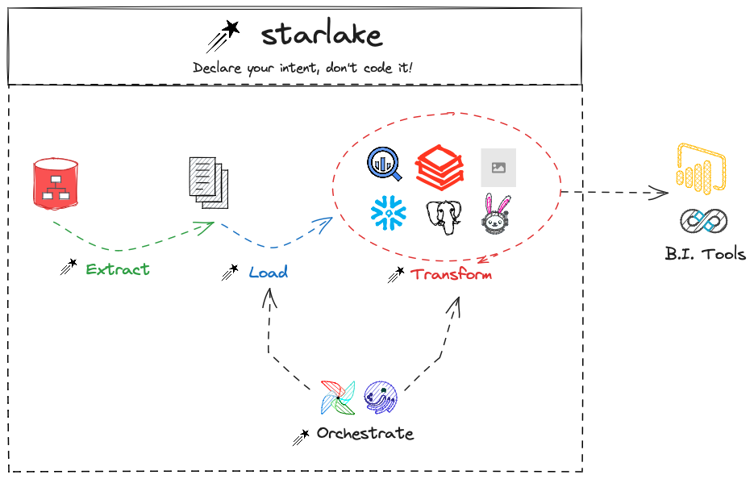
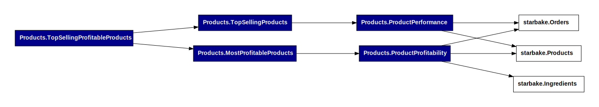
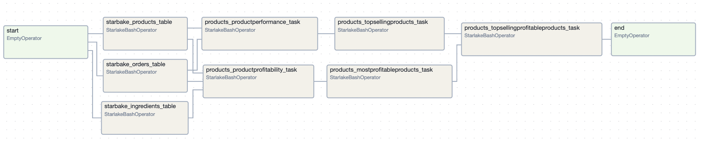
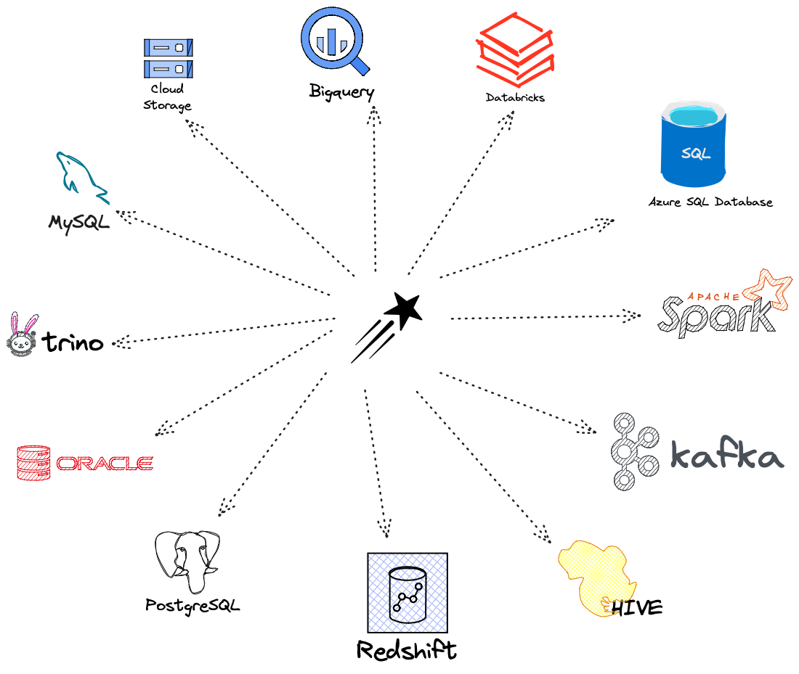

<p align="center">
  
</p>

<h3 align="center">Declarative Data Pipelines. Extract. Load. Transform. Orchestrate.</h3>

<p align="center">
  <a href="https://github.com/starlake-ai/starlake/workflows/Build/badge.svg"></a>
  <a href="https://central.sonatype.com/artifact/ai.starlake/starlake-core_2.13"></a>
  <a href="https://opensource.org/licenses/Apache-2.0"></a>
</p>

<p align="center">
  <a href="https://docs.starlake.ai/">Documentation</a> &bull;
  <a href="https://docs.starlake.ai/setup/starlake-core-setup">Installation</a> &bull;
  <a href="https://github.com/starlake-ai/starlake-data-stack">Data Stacks</a> &bull;
  <a href="https://docs.starlake.ai/devguide/contribute">Contributing</a>
</p>

---

Starlake replaces hundreds of lines of BigQuery/Snowflake/Redshift/Spark/SQL boilerplate with simple YAML declarations. Define **what** your data pipeline should do — Starlake figures out **how**.

Inspired by Terraform and Ansible, Starlake brings declarative programming to data engineering: schema inference, merge strategies, data quality checks, lineage tracking, and DAG generation — all from configuration files.

## Why Starlake?

- **No code, just config** - YAML declarations replace custom ETL scripts
- **Any warehouse** - BigQuery, Snowflake, Redshift, DuckDB, PostgreSQL, Delta Lake, Iceberg
- **Any orchestrator** - Airflow, Dagster, Snowflake Tasks with auto-generated DAGs
- **Any source** - JDBC databases, CSV, JSON, XML, fixed-width, Parquet, Kafka
- **Schema inference** - Auto-detect formats, headers, separators, and data types
- **Built-in data quality** - Expectations and validation at load time
- **Data lineage** - Automatic dependency tracking across your entire pipeline
- **Privacy controls** - Column-level encryption and access policies

## Quick Start

```bash
# Install (macOS/Linux)
curl -sSL https://raw.githubusercontent.com/starlake-ai/starlake/master/distrib/setup.sh | bash

# Create a new project from a template
starlake bootstrap

# Load data
starlake load

# Run transformations
starlake transform --name my_domain.my_table
```

Or use Docker:
```bash
docker run -it starlakeai/starlake:latest starlake bootstrap
```

For pre-built production-ready data stacks, see [Starlake Pragmatic Data Stacks](https://github.com/starlake-ai/starlake-data-stack).

## How It Works


### 1. Extract

Pull data from any JDBC source with a few lines of YAML:

```yaml
extract:
  connectionRef: "pg-adventure-works-db"
  jdbcSchemas:
    - schema: "sales"
      tables:
        - name: "salesorderdetail"
          partitionColumn: "salesorderdetailid"  # parallel extraction
          timestamp: salesdatetime               # incremental
```

### 2. Load

Define schemas, merge strategies, and data quality rules:

```yaml
table:
  pattern: "salesorderdetail.*.psv"
  metadata:
    writeStrategy:
      type: "UPSERT_BY_KEY_AND_TIMESTAMP"
      timestamp: signup
      key: [id]
  attributes:
    - name: "id"
      type: "string"
      required: true
    - name: "signup"
      type: "timestamp"
```

### 3. Transform

Write SQL, Starlake generates the correct MERGE/INSERT/OVERWRITE logic:

```yaml
transform:
  tasks:
    - name: most_profitable_products
      writeStrategy:
        type: "UPSERT_BY_KEY_AND_TIMESTAMP"
        timestamp: signup
        key: [id]
```
```sql
SELECT
  productid,
  SUM(unitprice * orderqty) AS total_revenue
FROM salesorderdetail
GROUP BY productid
ORDER BY total_revenue DESC
```

### 4. Orchestrate

Starlake extracts SQL dependencies and generates DAGs automatically:

<p align="center"></p>
<p align="center"></p>

Reference built-in templates for Airflow, Dagster, or Snowflake Tasks in your YAML — no custom DAG code required.

## Supported Platforms

<p align="center">
  
</p>

| Category | Supported |
|---|---|
| **Warehouses** | BigQuery, Snowflake, Redshift, DuckDB, PostgreSQL, Spark/Hive |
| **Lake Formats** | Delta Lake, Apache Iceberg, Parquet |
| **File Formats** | CSV/DSV, JSON, XML, Fixed-width, Parquet |
| **Orchestrators** | Airflow (v2 & v3), Dagster, Snowflake Tasks |
| **Streaming** | Kafka |
| **Cloud Storage** | GCS, S3, Azure Blob, HDFS, Local |

## Documentation

Full documentation at **[docs.starlake.ai](https://docs.starlake.ai/)**

- [Installation Guide](https://docs.starlake.ai/setup/starlake-core-setup)
- [Concepts & Architecture](https://docs.starlake.ai/)
- [Configuration Reference](https://docs.starlake.ai/)
- [Contributing](https://docs.starlake.ai/devguide/contribute)

## Contributing

Contributions are welcome! See our [Contributing Guide](https://docs.starlake.ai/devguide/contribute) and [Code of Conduct](CODE_OF_CONDUCT.md).

## License

Apache License 2.0 - see [LICENSE](LICENSE) for details.
