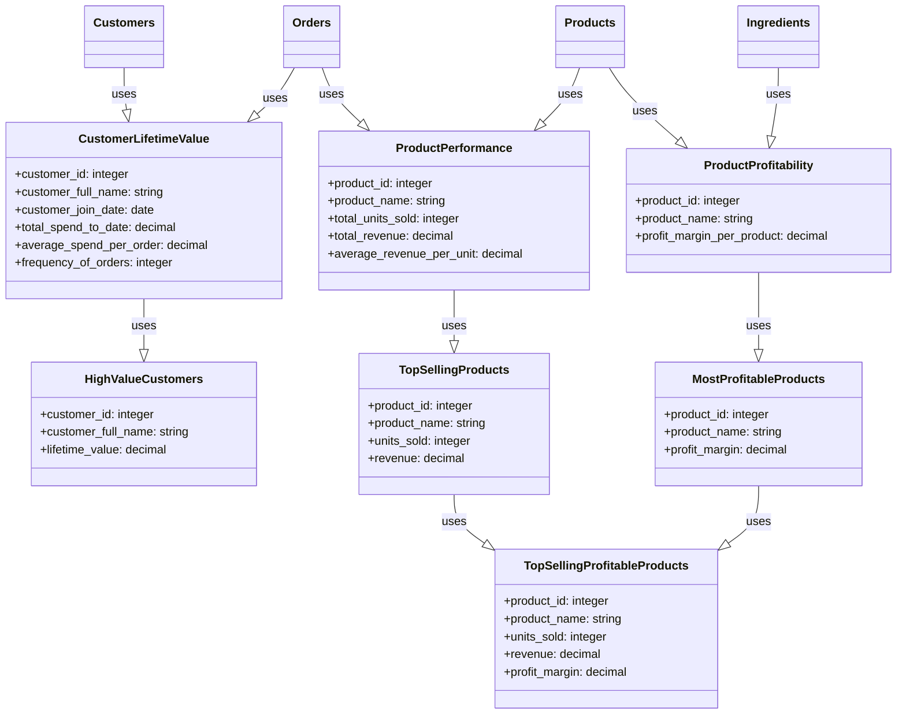

# Quickstart


import Tabs from '@theme/Tabs';
import TabItem from '@theme/TabItem';


## Download 


The project begins by collecting raw operational data from various domains, including digital transactions, customer interactions, inventory management,
and supplier relationships.

[Install starlake CLI](../setup/install),  clone the project and get started, run the following commands:

```bash
git clone https://github.com/starlake-ai/StarBake.git
cd starbake
```


## Starbake Commerce

To illustrate Starlake features, we will use the StarBake github project.
StarBake is a fictional & demonstrative project designed to showcase the usage of Starlake for data loading, transformation and analytics
in an e-commerce bakery business setting.




## Generate sample data
Since we don't have any data yet, we will generate some sample data using the `_scripts/dummy_data_generator.py` script.
Ths will allow us to get started with the project and start building our data platform.

```bash
$ pip install faker
$ python _scripts/dummy_data_generator.py
```


## Configure the connection to your datawarehouse

```yaml

application:
  loader: "native" # "spark" (default) or "native"
  connectionRef: starbake-bigquery # of localFileSystem (see below)

  connections:
    starbake-bigquery: # connection to bigquery
      type: "bigquery"
      options:
        location: europe-west1
        authType: "APPLICATION_DEFAULT"
        authScopes: "https://www.googleapis.com/auth/cloud-platform"
        writeMethod: "direct"
    localFileSystem:
        type: "fs" # Connection to local file system (parquet files)
```

## Infer data schemas
We will use these fake data files to load the files into our datawarehouse. But we first need to create a YAML description of the structure of the file.

Instead of writing them by hand, we will use the `infer-schema`command to have those YAML description files generated:

```bash
$ cd $HOME/quickstart

$ starlake infer-schema                               \
    --domain starbake                                 \
    --table Customers                                 \
    --input _data/day_1/customers_1.csv               \
    --write OVERWRITE                                 \
    --with-header

$ starlake infer-schema                               \
    --domain starbake                                 \
    --table Ingredients                               \
    --input _data/day_1/ingredients_1.csv             \
    --write APPEND                                    \
    --with-header

$ starlake infer-schema                              \
    --domain starbake                                \
    --table Orders                                   \
    --input _data/day_1/orders_1.csv                 \
    --write APPEND                                   \
    --with-header

$ starlake infer-schema                              \
    --domain starbake                                \
    --table Products                                 \
    --input _data/day_1/products_1.csv               \
    --write APPEND                                   \
    --with-header

```

The YAML schema descriptors are now present in the `metadata/load` folder

## Load

To load the data into the datawarehouse, we will use the `load` command:

```bash

$ starlake load

```

That's it. We just loaded our first data into the datawarehouse.

After adding referential integrity constraints, we can improve the performance of our queries or just display 
the tables relationships using the `table-dependencies` command:

```bash

$ starlake table-dependencies

```


## Transform

We will now build our first datamart. A data mart is a set of tables that are optimized for a specific use case.
We will build two data marts:
- the first one (customers) will be used to compute the customer lifetime value
- the second one (products) will be used to compute the product profitability

In the `metadata/transform` folder, we can two directories, one for each datamart and define the SQL transforamtions to obtain the desired datamarts.


To run the transformations, we will use the `transform` command:

```bash
$ starbake transform --name Customers.CustomerLifetimeValue 
$ starbake transform --name Customers.HighValueCustomers 


$ starbake transform --recursive --name Products.TopSellingProfitableProducts 

```

By specifying recursive, we are telling Starlake to run all the transformations that are required to build the specified datamart.
Starlake will in addition also run teh following command automatically by inferring the data lineage from the SQL requests:

```bash
$ starbake transform --name Products.ProductProfitability 
$ starbake transform --name Products.MostProfitableProducts 

$ starbake transform --name Products.ProductPerformance 

$ starbake transform --name Products.TopSellingProducts 
```


To previewthe lineage of the data, we can use the `lineage` command:

```bash
$ starlake lineage --name Products.TopSellingProfitableProducts
```


That's it, notice that we are not required to specify the output table name, it is automatically inferred from the file name by default.


## Going further
Check the user guide to see how you can easily:
- schedule the data loading and transformation tasks
- monitor the data platform
- run the data quality checks
- expose your data catalog and data marts to your data consumers through a website
