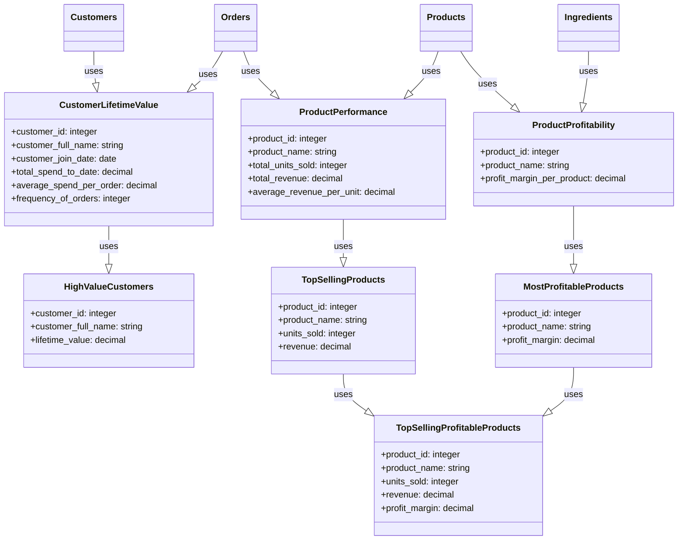

# Quickstart

## Starbake Commerce

To illustrate Starlake features, we will use the StarBake github project.
StarBake is a fictional & demonstrative project designed to showcase the usage of Starlake for data loading, transformation and analytics
in an e-commerce bakery business setting.




## Download 
The project begins by collecting raw operational data from various domains, including digital transactions, customer interactions, inventory management,
and supplier relationships.

To clone the project and get started, run the following commands:

```bash
git clone https://github.com/starlake-ai/StarBake.git
cd starbake
```
