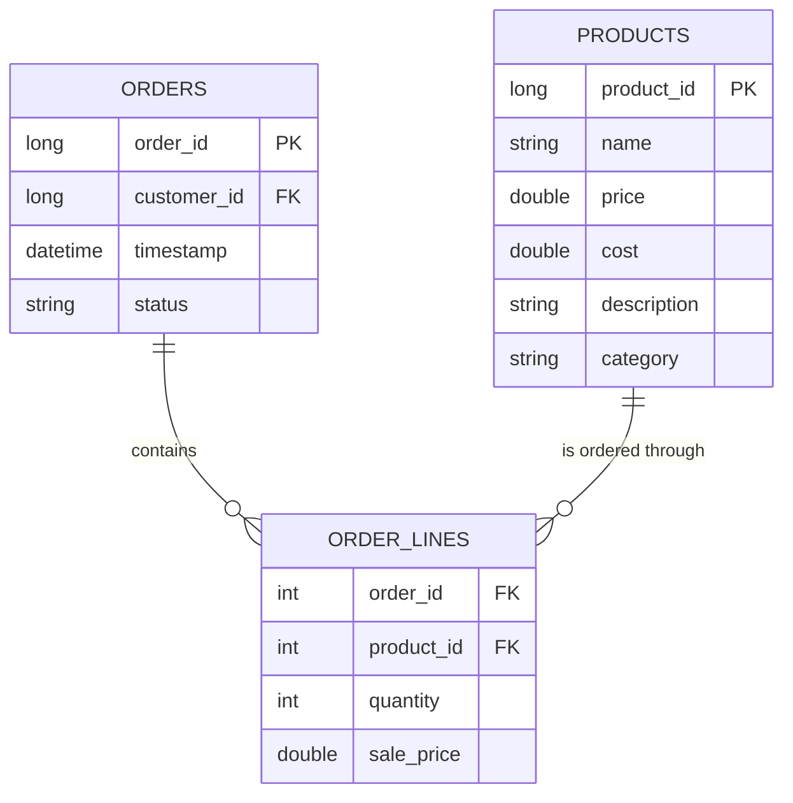
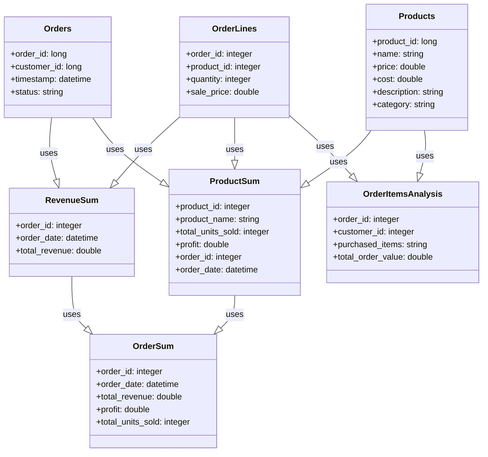

# DuckLake - Starlake TPC-H Data Pipeline Example

This project demonstrates an end-to-end data pipeline for the [TPC-H](https://www.tpc.org/tpch/) benchmark using [Starlake](https://github.com/starlake-ai/starlake). It showcases data ingestion, transformation, and analytics on industry-standard datasets, with a focus on reproducibility and modularity.

## Project Overview

DuckLake ingests and processes TPC-H benchmark data, a standard for decision support and analytics. The project is organized to follow best practices for data engineering with Starlake:

- **Data Ingestion**: Raw TPC-H data (CSV) is loaded from the `datasets/` directory.
- **Data Processing**: Starlake YAML metadata in `metadata/` defines schemas, types, and data quality rules.
- **Data Analytics**: SQL transformations in `metadata/transform/` generate business insights and KPIs.

## Project Structure

```
├── datasets/              # Data directories for all pipeline stages
│   ├── archive/           # Archived source data (e.g., TPC-H CSVs)
│   ├── data_files/        # Partitioned and processed data files
│   ├── incoming/          # Dropzone for new data
│   ├── stage/             # Intermediate processing
│   └── unresolved/        # Files with issues
│
├── metadata/              # Starlake configuration and pipeline logic
│   ├── application.sl.yml # Main Starlake application config
│   ├── dags/              # Orchestration workflows (Airflow, Dagster, Snowflake)
│   ├── expectations/      # Data quality templates
│   ├── load/tpch/         # Table schemas for TPC-H (YAML)
│   ├── transform/kpi/     # SQL transformations for analytics
│   └── types/             # Data type definitions
│
├── sample-data/           # Example data for testing (e.g., starbake/)
└── README.md
```

## TPC-H Tables

The following TPC-H tables are defined in `metadata/load/tpch/` and ingested from CSV files in `datasets/archive/tpch/`:

- **CUSTOMER**: Customer information (C_CUSTKEY, C_NAME, C_ADDRESS, ...)
- **ORDERS**: Orders placed (O_ORDERKEY, O_CUSTKEY, O_ORDERSTATUS, ...)
- **LINEITEM**: Line items for each order (L_ORDERKEY, L_PARTKEY, L_SUPPKEY, ...)
- **PART**: Product catalog (P_PARTKEY, P_NAME, P_MFGR, ...)
- **PARTSUPP**: Supplier-part relationships (PS_PARTKEY, PS_SUPPKEY, ...)
- **SUPPLIER**: Supplier information (S_SUPPKEY, S_NAME, ...)
- **NATION**: Nation reference data (N_NATIONKEY, N_NAME, ...)
- **REGION**: Region reference data (R_REGIONKEY, R_NAME, ...)

Each table's schema, types, and sample values are defined in the corresponding YAML file under `metadata/load/tpch/`.

## Transformations & Analytics

SQL transformations in `metadata/transform/kpi/` implement TPC-H business queries and KPIs, such as:

- Pricing summary
- Top suppliers
- Revenue and profit analysis
- Shipping and order priority queries

These queries can be run as part of the pipeline or independently for analytics.

## Orchestration

Workflows for Airflow, Dagster, and Snowflake are provided in `metadata/dags/` for flexible orchestration and scheduling.

## How to Run

1. Place TPC-H CSV data files in `datasets/archive/tpch/` (see [TPC-H data generator](https://www.tpc.org/tpch/)).
2. Configure your environment in `metadata/application.sl.yml` and `metadata/types/` as needed.
3. Use Starlake CLI or your orchestrator to launch the pipeline (see workflow YAMLs in `metadata/dags/`).
4. Processed data will appear in `datasets/data_files/tpch/`.

## Development Guide

- All configuration files use the `.sl.yml` extension.
- Table schemas and types are in `metadata/load/tpch/` and `metadata/types/`.
- Transformations are SQL files in `metadata/transform/kpi/`.
- Data quality rules are in `metadata/expectations/`.
- Sample data for quick tests is in `sample-data/`.

## References

- [Starlake Documentation](https://github.com/starlake-ai/starlake)
- [TPC-H Benchmark](https://www.tpc.org/tpch/)

---
This project provides a reproducible, modular example of a TPC-H data pipeline using Starlake, suitable for analytics, benchmarking, and data engineering best practices.

Here's a breakdown of the tables with column descriptions based on the actual configurations in `metadata/load/starbake/`:

1. **Orders:** This table contains information about the bakery's orders. The data for this table arrives in JSON format, updated daily.
    - `order_id` (PK): A unique identifier for each order. Data type: Long.
    - `customer_id` (FK): An identifier for the customer who placed the order. Data type: Long.
    - `timestamp`: The date and time when the order was placed. Data type: ISO DateTime.
    - `status`: The status of the order, such as 'Pending', 'Delivered', or 'Cancelled'. Data type: String.

2. **Order Lines:** This table contains the line items for each order. The data arrives in CSV format with semicolon separator.
    - `order_id` (FK): References the order this line belongs to. Data type: Integer.
    - `product_id` (FK): References the product ordered. Data type: Integer.
    - `quantity`: The quantity of the product ordered. Data type: Integer.
    - `sale_price`: The price at which the product was sold. Data type: Double.

3. **Products:** This table contains information about the bakery's products. The data arrives in XML format.
    - `product_id` (PK): A unique identifier for each product. Data type: Long.
    - `name`: The product's name. Data type: String.
    - `price`: The selling price of the product. Data type: Double.
    - `cost`: The cost to produce the product. Data type: Double.
    - `description`: A detailed description of the product. Data type: String.
    - `category`: The category of the product, such as 'Cakes', 'Cookies', etc. Data type: String.

The data type mentioned in each field is a common standard, but the exact type can change depending on the database you are using. JSON objects and arrays are usually represented as strings in a database but parsed into their respective data structures when needed.





### Business Insights Transformations:

The project implements several key data transformations stored in `metadata/transform/kpi/` to convert raw data into actionable business insights:

1. **Order Items Analysis:** This transformation (`order_items_analysis.sql`) aggregates order line items to provide insights into what products are frequently purchased together. It calculates the total order value and provides a list of products with quantities purchased in each order.

2. **Product Summary:** This transformation (`product_summary.sql`) analyzes product performance by calculating total units sold and profit for each product per order. It joins products with order lines and orders to create a comprehensive view of product performance over time.

3. **Revenue Summary:** This transformation (`revenue_summary.sql`) calculates the total revenue generated by each order by summing the quantities and sale prices from the order lines associated with each order.

4. **Order Summary:** This transformation (`order_summary.sql`) combines the product summary and revenue summary data to provide a complete overview of each order, including order date, total revenue, profit, and total units sold.


The project aims to give users a practical understanding of Starlake's functionalities, allowing them to leverage these features for their data transformation and analytics requirements.

## How to Run

Please check [HOW_TO_RUN.md](HOW_TO_RUN.md) for detailed instructions on setting up and running the StarBake project.

### Quick Start

1. Ensure you have the required dependencies installed
2. Configure your target data warehouse environment in the `metadata/env.*.sl.yml` files
3. Place your input data files in the `datasets/incoming/starbake/` directory
4. Run the Starlake data processing commands (see HOW_TO_RUN.md for details)

## Development Guide

This project follows specific conventions for data processing with Starlake:

- Configuration files use the `.sl.yml` extension
- Transformations are written in SQL and stored in the `metadata/transform/` directory
- Data quality expectations are defined as templates in `metadata/expectations/`
- Multiple orchestration options are available including Airflow and Dagster
*