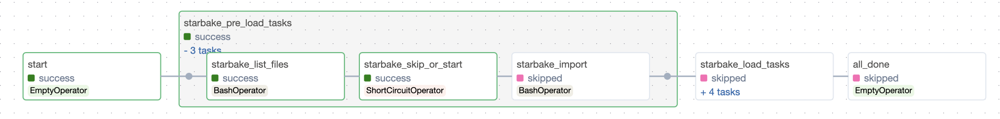
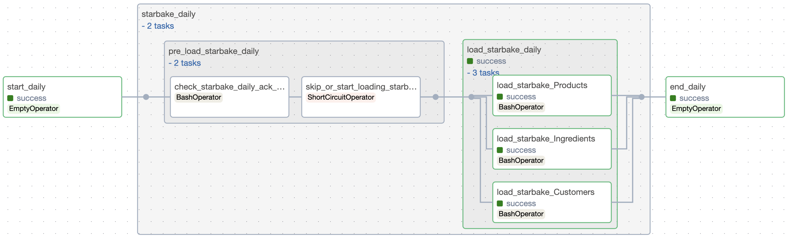

# starlake-airflow

**starlake-airflow** is the **[Starlake](https://starlake-ai.github.io/starlake/index.html)** Python Distribution for **Airflow**.

It is recommended to use it in combinaison with **[starlake dag generation](https://starlake-ai.github.io/starlake/docs/concepts/orchestration)**, but can be used directly as is in your **DAGs**.

## AirflowStarlakeJob

`ai.starlake.job.airflow.AirflowStarlakeJob` is an **abstract factory class** that extends the generic factory interface `ai.starlake.job.IStarlakeJob` and is responsible for **generating** the **Airflow tasks** that will run the `import`, [load](https://starlake-ai.github.io/starlake/docs/concepts/load) and [transform](https://starlake-ai.github.io/starlake/docs/concepts/transform) starlake commands.

### sl_import

It generates the Airflow task that will run the starlake [import](https://starlake-ai.github.io/starlake/docs/cli/import) command.

```python
def sl_import(
    self, 
    task_id: str, 
    domain: str, 
    **kwargs) -> BaseOperator:
    #...
```

| name    | type | description                                           |
| ------- | ---- | ----------------------------------------------------- |
| task_id | str  | the optional task id (*{domain}_import* by default) |
| domain  | str  | the required domain to import                         |

### sl_load

It generates the Airflow task that will run the starlake [load](https://starlake-ai.github.io/starlake/docs/cli/load) command.

```python
def sl_load(
    self, 
    task_id: str, 
    domain: str, 
    table: str, 
    spark_config: StarlakeSparkConfig=None,
    **kwargs) -> BaseOperator:
    #...
```

| name         | type                | description                                                 |
| ------------ | ------------------- | ----------------------------------------------------------- |
| task_id      | str                 | the optional task id (*{domain}_{table}_load* by default) |
| domain       | str                 | the required domain of the table to load                    |
| table        | str                 | the required table to load                                  |
| spark_config | StarlakeSparkConfig | the optional `ai.starlake.job.StarlakeSparkConfig`        |

### sl_transform

It generates the Airflow task that will run the starlake [transform](https://starlake-ai.github.io/starlake/docs/cli/transform) command.

```python
def sl_transform(
    self, 
    task_id: str, 
    transform_name: str, 
    transform_options: str=None, 
    spark_config: StarlakeSparkConfig=None, **kwargs) -> BaseOperator:
    #...
```

| name              | type                | description                                            |
| ----------------- | ------------------- | ------------------------------------------------------ |
| task_id           | str                 | the optional task id (*{transform_name}* by default) |
| transform_name    | str                 | the transform to run                                   |
| transform_options | str                 | the optional transform options                         |
| spark_config      | StarlakeSparkConfig | the optional `ai.starlake.job.StarlakeSparkConfig`   |

### sl_job

Ultimitely, all of these methods will call the `sl_job` method that neeeds to be **implemented** in all **concrete** factory classes.

```python
def sl_job(
    self, 
    task_id: str, 
    arguments: list, 
    spark_config: StarlakeSparkConfig=None, 
    **kwargs) -> BaseOperator:
    #...
```

| name         | type                | description                                           |
| ------------ | ------------------- | ----------------------------------------------------- |
| task_id      | str                 | the required task id                                  |
| arguments    | list                | The required arguments of the starlake command to run |
| spark_config | StarlakeSparkConfig | the optional `ai.starlake.job.StarlakeSparkConfig`  |

### Init

To initialize this class, you may specify the optional **pre load strategy** and **options** to use.

```python
    def __init__(self, pre_load_strategy: Union[StarlakePreLoadStrategy, str, None], options: dict=None, **kwargs) -> None:
        """Overrides IStarlakeJob.__init__()
        Args:
            pre_load_strategy (Union[StarlakePreLoadStrategy, str, None]): The pre-load strategy to use.
            options (dict): The options to use.
        """
        super().__init__(pre_load_strategy, options, **kwargs)
        #...
```

#### StarlakePreLoadStrategy

`ai.starlake.job.StarlakePreLoadStrategy` is an enum that defines the different **pre load strategies** that can be used to conditionaly load a domain.

The pre load strategy is implemented by `sl_pre_load` method that will generate the Airflow group of tasks corresponding to the strategy choosen.

```python
def sl_pre_load(
    self, 
    domain: str, 
    pre_load_strategy: Union[StarlakePreLoadStrategy, str, None]=None,
    **kwargs) -> BaseOperator:
    #...
```

| name              | type | description                                                        |
| ----------------- | ---- | ------------------------------------------------------------------ |
| domain            | str  | the domain to load                                                 |
| pre_load_strategy | str  | the optional pre load strategy (self.pre_load_strategy by default) |

##### StarlakePreLoadStrategy.NONE

No pre load strategy.

##### StarlakePreLoadStrategy.IMPORTED

This strategy implies that at least one file is present in the landing area (`SL_ROOT/importing/{domain}` by default if option `incoming_path` has not been specified). If there is one or more files to load, the method `sl_import` will be called to import the domain before loading it, otherwise the loading of the domain will be skipped.



##### StarlakePreLoadStrategy.PENDING

This strategy implies that at least one file is present in the pending datasets area of the domain (`SL_ROOT/datasets/pending/{domain}` by default if option `pending_path` has not been specified), otherwise the loading of the domain will be skipped.


##### StarlakePreLoadStrategy.ACK

This strategy implies that a **ack file** is present at the specified path (option `global_ack_file_path`), otherwise the loading of the domain will be skipped.



#### Options

The following options can be specified for all concrete factory classes:

| name                           | type | description                                                                                 |
| ------------------------------ | ---- | ------------------------------------------------------------------------------------------- |
| **default_pool**         | str  | pool of slots to use (`default_pool` by default)                                          |
| **pre_load_strategy**    | str  | one of `none` (default), `imported`, `pending` or `ack`                             |
| **incoming_path**        | str  | path to the landing area for the domain to load (`{SL_ROOT}/incoming` by default)         |
| **pending_path**         | str  | path to the pending datastets for the domain to load (`{SL_DATASETS}/pending` by default) |
| **global_ack_file_path** | str  | path to the ack file (`{SL_DATASETS}/pending/{domain}/{{{{ds}}}}.ack` by default)         |
| **ack_wait_timeout**     | int  | timeout in seconds to wait for the ack file(`1 hour` by default)                          |

## On premise

### AirflowStarlakeBashJob

This class is a concrete implementation of `AirflowStarlakeJob` that generates tasks using `airflow.operators.bash.BashOperator`.

## Google Cloud Platform

### AirflowStarlakeDataprocJob

This class is a concrete implementation of `AirflowStarlakeJob` that generates tasks using `airflow.providers.google.cloud.operators.dataproc.DataprocSubmitJobOperator`.

### AirflowStarlakeCloudRunJob

This class is a concrete implementation of `AirflowStarlakeJob` that generates tasks using `airflow.operators.bash.BashOperator` and, if the execution has been parameterized to be **asynchronous**, `airflow.sensors.bash.BashSensor` to wait for the completion of the **Cloud Run job** execution.

## Amazon Web Services

## Azure
