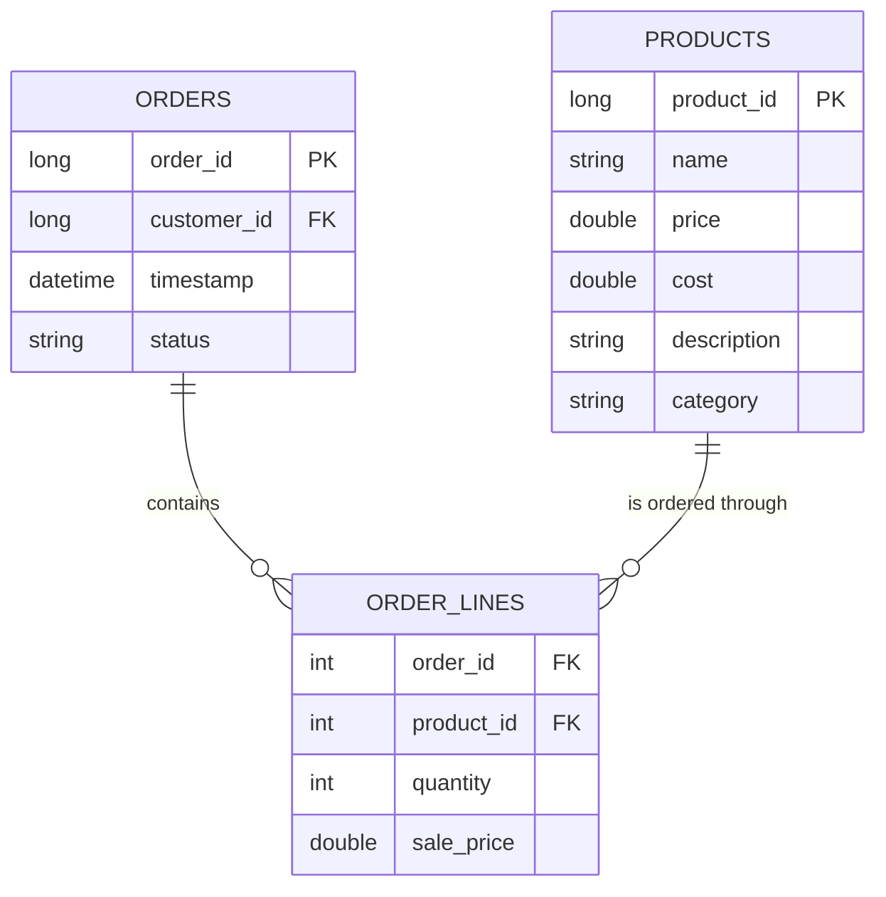
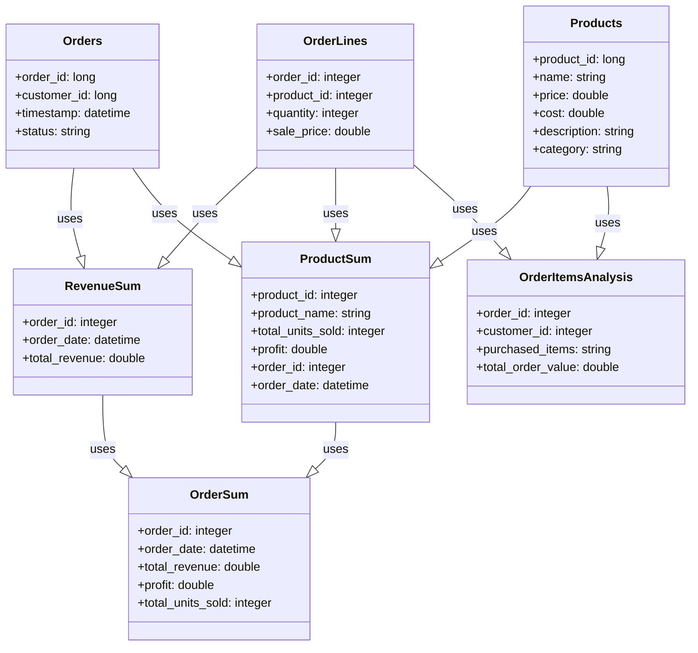

# StarBake - Starlake Data Processing Example

**StarBake** is a fictional & demonstrative project designed to showcase the usage of Starlake for data transformation and analytics in an e-commerce bakery business setting. The project demonstrates end-to-end data processing including data ingestion, transformation, and analytics capabilities.

## Project Overview

StarBake collects raw operational data from various domains, including digital transactions, customer interactions, inventory management, and supplier relationships. This project is structured to follow industry best practices for data processing with Starlake, organized into:

- **Data Ingestion**: Consuming raw data from source systems in multiple formats (JSON, CSV, XML)
- **Data Processing**: Transforming raw data into analytical models
- **Data Analytics**: Creating business insights through SQL transformations

The final goal of StarBake is to provide users a practical understanding of how Starlake can be harnessed for data ingestion, transformation, and analytics. The project focuses on Google BigQuery as the data warehousing solution. Through this project, users will get hands-on experience in gleaning a wide range of business insights, including customer lifetime value, product performance, product profitability, and customer preferences.

## Project Structure

```
├── datasets/              # Data directories for different processing stages
│   ├── archive/           # Archived processed data
│   ├── incoming/          # New data files ready for processing
│   ├── replay/            # Data for replay/reprocessing scenarios
│   ├── stage/             # Intermediate processing stage
│   └── unresolved/        # Files with issues that couldn't be processed
│
├── metadata/              # Starlake configuration files
│   ├── application.sl.yml # Main application configuration
│   ├── env.*.sl.yml       # Environment-specific configurations
│   ├── dags/              # Workflow definitions for various orchestration tools
│   ├── expectations/      # Data quality expectations templates
│   ├── external/          # External system configurations
│   ├── extract/           # Data extraction definitions
│   ├── load/              # Data loading configurations
│   ├── mapping/           # Data mapping definitions
│   ├── transform/         # SQL transformation queries
│   └── types/             # Data type definitions
│
└── sample-data/           # Sample datasets for testing and development
```

## Tables to Ingest:

Here's a breakdown of the tables with column descriptions based on the actual configurations in `metadata/load/starbake/`:

1. **Orders:** This table contains information about the bakery's orders. The data for this table arrives in JSON format, updated daily.
    - `order_id` (PK): A unique identifier for each order. Data type: Long.
    - `customer_id` (FK): An identifier for the customer who placed the order. Data type: Long.
    - `timestamp`: The date and time when the order was placed. Data type: ISO DateTime.
    - `status`: The status of the order, such as 'Pending', 'Delivered', or 'Cancelled'. Data type: String.

2. **Order Lines:** This table contains the line items for each order. The data arrives in CSV format with semicolon separator.
    - `order_id` (FK): References the order this line belongs to. Data type: Integer.
    - `product_id` (FK): References the product ordered. Data type: Integer.
    - `quantity`: The quantity of the product ordered. Data type: Integer.
    - `sale_price`: The price at which the product was sold. Data type: Double.

3. **Products:** This table contains information about the bakery's products. The data arrives in XML format.
    - `product_id` (PK): A unique identifier for each product. Data type: Long.
    - `name`: The product's name. Data type: String.
    - `price`: The selling price of the product. Data type: Double.
    - `cost`: The cost to produce the product. Data type: Double.
    - `description`: A detailed description of the product. Data type: String.
    - `category`: The category of the product, such as 'Cakes', 'Cookies', etc. Data type: String.

The data type mentioned in each field is a common standard, but the exact type can change depending on the database you are using. JSON objects and arrays are usually represented as strings in a database but parsed into their respective data structures when needed.





### Business Insights Transformations:

The project implements several key data transformations stored in `metadata/transform/kpi/` to convert raw data into actionable business insights:

1. **Order Items Analysis:** This transformation (`order_items_analysis.sql`) aggregates order line items to provide insights into what products are frequently purchased together. It calculates the total order value and provides a list of products with quantities purchased in each order.

2. **Product Summary:** This transformation (`product_summary.sql`) analyzes product performance by calculating total units sold and profit for each product per order. It joins products with order lines and orders to create a comprehensive view of product performance over time.

3. **Revenue Summary:** This transformation (`revenue_summary.sql`) calculates the total revenue generated by each order by summing the quantities and sale prices from the order lines associated with each order.

4. **Order Summary:** This transformation (`order_summary.sql`) combines the product summary and revenue summary data to provide a complete overview of each order, including order date, total revenue, profit, and total units sold.


The project aims to give users a practical understanding of Starlake's functionalities, allowing them to leverage these features for their data transformation and analytics requirements.

## How to Run

Please check [HOW_TO_RUN.md](HOW_TO_RUN.md) for detailed instructions on setting up and running the StarBake project.

### Quick Start

1. Ensure you have the required dependencies installed
2. Configure your target data warehouse environment in the `metadata/env.*.sl.yml` files
3. Place your input data files in the `datasets/incoming/starbake/` directory
4. Run the Starlake data processing commands (see HOW_TO_RUN.md for details)

## Development Guide

This project follows specific conventions for data processing with Starlake:

- Configuration files use the `.sl.yml` extension
- Transformations are written in SQL and stored in the `metadata/transform/` directory
- Data quality expectations are defined as templates in `metadata/expectations/`
- Multiple orchestration options are available including Airflow and Dagster

