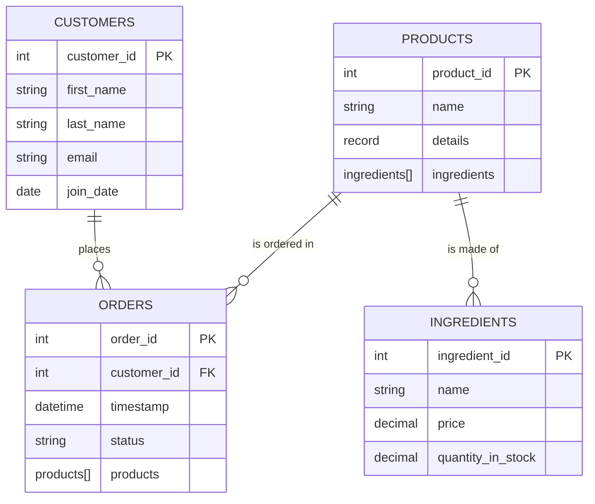
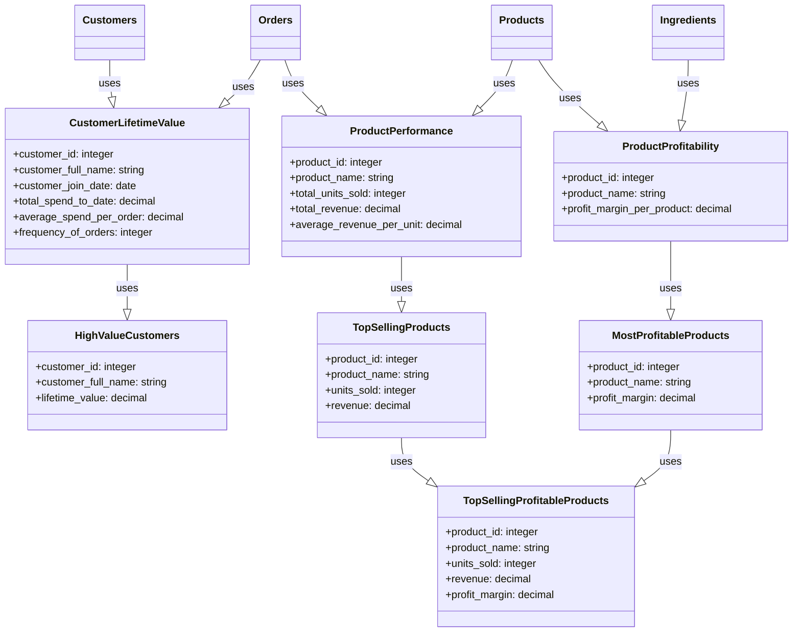

## StarBake

**StarBake** is a fictional & demonstrative project designed to showcase the usage of Starlake for data transformation and analytics in an e-commerce bakery business setting. The project begins by collecting raw operational data from various domains, including digital transactions, customer interactions, inventory management, and supplier relationships.

This data is organized into six primary tables: Customers, Orders, Products, Suppliers, Ingredients, and ProductIngredients. Each table contains relevant data fields that are updated daily, with data arriving in JSON, JsonND, or CSV format.

The core of the StarBake project lies in its transformation of the ingested raw data. The data is converted into meaningful business insights by creating a series of analytical-ready tables: CustomerLifetimeValue, ProductPerformance, ProductProfitability, HighValueCustomers, TopSellingProducts, and MostProfitableProducts. Further tables (TopSellingProfitableProducts and HighValueCustomerPreferences) are created by joining multiple transformed tables to deliver more nuanced business insights.

The final goal of StarBake is to provide users a practical understanding of how Starlake can be harnessed for data ingestion, transformation, and analytics. The project focuses on Google BigQuery as the data warehousing solution. Through this project, users will get hands-on experience in gleaning a wide range of business insights, including customer lifetime value, product performance, product profitability, and customer preferences.

### Tables to Ingest:

Here's a breakdown of the tables with column descriptions:

1. **Customers:** This table contains information about the bakery's customers. The data for this table arrives in CSV format, updated daily with deltas.
    - `customer_id` (PK): A unique identifier for each customer. Data type: Integer or UUID.
    - `first_name`: The customer's first name. Data type: String.
    - `last_name`: The customer's last name. Data type: String.
    - `email`: The customer's email address. Data type: String.
    - `join_date`: The date when the customer joined. Data type: Date.

2. **Orders:** This table contains information about the bakery's orders. The data for this table arrives in JSON format, updated daily with deltas.
    - `order_id` (PK): A unique identifier for each order. Data type: Integer or UUID.
    - `customer_id` (FK): An identifier for the customer who placed the order. Data type: Integer or UUID, referencing `Customers.customer_id`.
    - `timestamp`: The date and time when the order was placed. Data type: DateTime.
    - `status`: The status of the order, such as 'placed', 'shipped', or 'delivered'. Data type: String.
    - `products`: An array of objects, each containing `product_id`, `quantity`, and `price`. Each object represents a product in the order.
        - `product_id`: An identifier for the product. Data type: Integer or UUID, referencing `Products.product_id`.
        - `quantity`: The quantity of this product in the order. Data type: Integer.
        - `price`: The price of the product at the time of ordering. Data type: Decimal.

3. **Products:** This table contains information about the bakery's products. The data for this table arrives in JSON_ND format, updated daily with deltas.
    - `product_id` (PK): A unique identifier for each product. Data type: Integer or UUID.
    - `name`: The product's name. Data type: String. 
    - `details`: A record containing additional details about the product.
        - `price`: The current[orders.yaml](domains%2Forders.yaml) price of the product. Data type: Decimal.
        - `description`: A detailed description of the product. Data type: String.
        - `category`: The category of the product, such as 'bread', 'cake', or 'pastry'. Data type: String.
    - `ingredients`: An array of objects, each containing `ingredient_id` and `quantity`. Each object represents an ingredient needed to make the product.
        - `ingredient_id`: An identifier for the ingredient. Data type: Integer or UUID, referencing `Ingredients.ingredient_id`.
        - `quantity`: The quantity of this ingredient needed to make the product. Data type: Decimal.

4. **Ingredients:** This table contains information about the bakery's ingredients. The data for this table arrives in TSV format, updated daily with deltas.
    - `ingredient_id` (PK): A unique identifier for each ingredient. Data type: Integer or UUID.
    - `name`: The ingredient's name. Data type: String.
    - `price`: The current price of the ingredient. Data type: Decimal.
    - `quantity_in_stock`: The quantity of the ingredient currently in stock. Data type: Decimal.

The data type mentioned in each field is a common standard, but the exact type can change depending on the database you are using. JSON objects and arrays are usually represented as strings in a database but parsed into their respective data structures when needed.

### Business Insights transformations:

1. **CustomerLifetimeValue:** This table gives a projection of the total value a customer may bring to the bakery over the entirety of their relationship. This will be calculated using data from the `Customers` & `Orders` tables, and have total spend to date, average spend per order, and frequency of orders.

2. **ProductPerformance:** This table provides details on the performance of each product sold at the bakery, including the total number of units sold, total revenue generated, and average revenue per unit sold. It's derived from the `Orders` and `Products` tables.

3. **ProductProfitability:** This table offers insights into the profitability of each product. It considers the cost of production (based on the `Products` table & `INGREDIENTS` table for the cost of ingredients).

4. **HighValueCustomers:** This table identifies customers with the highest lifetime value, making it easier to target these customers for marketing campaigns. It's derived from the `CustomerLifetimeValue` table.

5. **TopSellingProducts:** This table identifies the products that perform the best in terms of units sold and revenue. It's derived from the `ProductPerformance` table.

6. **MostProfitableProducts:** This table identifies the most profitable products, allowing the bakery to focus on promoting these products to maximize profits. It's derived from the `ProductProfitability` table.

Additional tables that join multiple transformed tables:

7. **TopSellingProfitableProducts:** This table combines the `TopSellingProducts` and `MostProfitableProducts` tables to highlight the products that are not only top sellers but also bring in high profit margins.

The project aims to give users a practical understanding of Starlake's functionalities, allowing them to leverage these features for their data transformation and analytics requirements.

## How to run
Please check [HOW_TO_RUN.md](HOW_TO_RUN.md)

## To-Do List

#### Data Ingestion
- [x] Set up data ingestion mechanisms for each of the primary tables.
    - [x] Configure CSV data ingestion for the `Customers`, and `Ingredients` tables.
    - [x] Configure JSON data ingestion for the `Orders` table.
    - [x] Configure JsonND data ingestion for the `Products` table.

#### Data Transformation
- [x] Define transformations for creating analytical tables.
    - [x] Design transformations for CustomerLifetimeValue
    - [x] Design transformations for ProductPerformance
    - [x] Design transformations for ProductProfitability
    - [x] Design transformations for HighValueCustomers
    - [x] Design transformations for TopSellingProducts
    - [x] Design transformations for MostProfitableProducts
    - [x] Design transformations for TopSellingProfitableProducts

#### Data Combination
- [x] Combine multiple transformed tables to create new analytical tables.
    - [x] Create `TopSellingProfitableProducts` table by merging `TopSellingProducts` and `MostProfitableProducts`.

#### Workflow
- [ ] Add .vscode project configuration that include the necessary plugins.
- [ ] Add sqlfluff as sql formatter
- [ ] Add pre-hook to compile & format the code before commit
